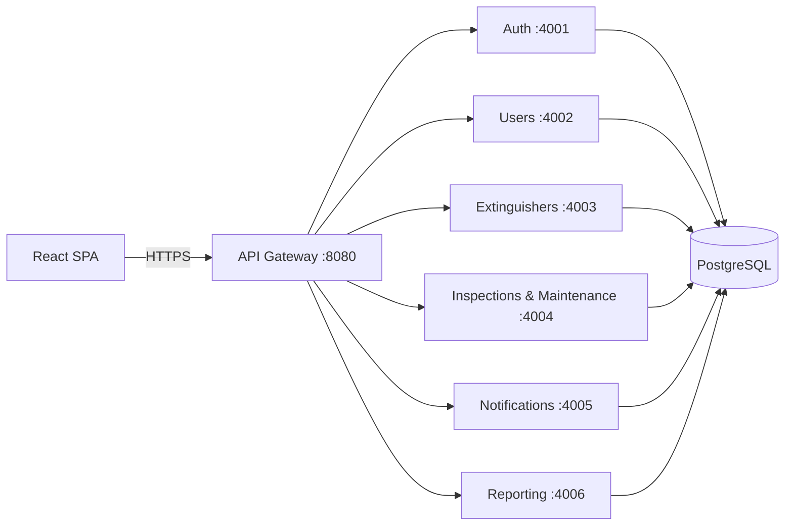

# TZW LTD — Fire Extinguisher Management System (FEMS)

A production-style, **RESTful microservices** platform for managing fire
extinguishers across commercial buildings: status tracking, inspection
scheduling, maintenance logging, compliance monitoring, real-time reporting and
notifications — with a modern enterprise dashboard.

> University project deliverable. The system is intentionally built to resemble
> a small commercial enterprise application rather than a simple academic CRUD.

---

## Highlights

- **6 microservices** + an **API gateway**, each independently deployable.
- **JWT authentication** with refresh-token rotation and **RBAC** (ADMIN / INSPECTOR / USER).
- **PostgreSQL** relational schema with constraints, indexes, triggers and audit logging.
- **OpenAPI 3.0 / Swagger** docs for every service (interactive UI at `/docs`).
- **React + Vite + Tailwind + Tremor** dashboard with charts, dark mode, smart
  search, data tables (CSV/PDF export), confirmations and toasts.
- **Security**: password hashing (bcrypt), input validation (Zod), rate limiting,
  CORS allow-list, secure headers (helmet), parameterised SQL, centralised error
  handling that never leaks internals.
- **Tests**: unit + integration/API tests with a generated report.
- **Docker Compose** one-command bring-up.

---

## Architecture at a glance



See [`docs/01-system-architecture.md`](docs/01-system-architecture.md) for the full design.

---

## Quick start

### Option A — Docker (recommended)

```bash
cp .env.example .env          # adjust secrets for production
docker compose up -d --build  # starts db + 6 services + gateway + frontend
# Frontend:  http://localhost:5173
# Gateway:   http://localhost:8080
# API docs:  http://localhost:8080/docs
```

The database schema and reference data are applied automatically on first boot.
Seed sample data with:

```bash
docker compose exec gateway npm run db:seed --prefix /app
```

### Option B — Local (Node 20+)

```bash
npm install                   # install all workspaces
# Start a PostgreSQL 16 instance and point DATABASE_URL at it (see .env)
npm run db:migrate            # create schema + reference data
npm run db:seed               # load realistic sample data
npm run dev                   # start all services + gateway (concurrently)

cd frontend && npm run dev    # start the SPA at http://localhost:5173
```

### Demo accounts (password `Password123!`)

| Role      | Email               |
| --------- | ------------------- |
| ADMIN     | `brillanteigabemurangwa@gmail.com` |
| INSPECTOR | `inspector@tzw.com` |
| USER      | `user@tzw.com`      |

---

## Repository layout

```
TZWltd/
├── packages/shared/        # Shared library (config, db, logging, auth, errors, middleware)
├── services/
│   ├── auth-service/        # Registration, login, JWT, profile, password reset
│   ├── user-service/        # Admin user & role management (RBAC)
│   ├── extinguisher-service/# Fire extinguisher CRUD + search/filter/pagination
│   ├── inspection-service/  # Inspection scheduling + maintenance logs + timelines
│   ├── notification-service/# Notification generation + history
│   └── reporting-service/   # Reports + dashboard aggregate + CSV/PDF + audit logs
├── gateway/                 # API gateway (routing, security, aggregated Swagger)
├── frontend/                # React + Vite + Tailwind + Tremor dashboard
├── database/                # SQL schema, reference data, migrate/seed, backup scripts
├── tests/                   # Unit + integration/API tests + report generator
├── docs/                    # Architecture, ERD, API, manuals, deployment, test results
├── docker-compose.yml
└── Dockerfile               # Generic image used by every Node service
```

A detailed walkthrough is in [`docs/09-folder-structure.md`](docs/09-folder-structure.md).

---

## Documentation index (`/docs`)

1. [System Architecture](docs/01-system-architecture.md)
2. [Microservices Design](docs/02-microservices-design.md)
3. [Database Design & ERD](docs/03-database-design.md)
4. [API Guide](docs/04-api-guide.md)
5. [Installation Guide](docs/05-installation-guide.md)
6. [Deployment Guide](docs/06-deployment-guide.md)
7. [User Manual](docs/07-user-manual.md)
8. [Security](docs/08-security.md)
9. [Folder Structure](docs/09-folder-structure.md)
10. [Test Results](docs/test-results/TEST-RESULTS.md)

---

## Scripts

| Command | Description |
| ------- | ----------- |
| `npm run dev` | Run all services + gateway locally |
| `npm run db:migrate` | Apply schema + reference data |
| `npm run db:seed` | Load sample data |
| `npm test` | Run unit + integration tests |
| `npm run test:report` | Generate the Markdown test report |
| `npm run start:gateway` | Start just the gateway |

---

## License

MIT © TZW LTD (academic project).
