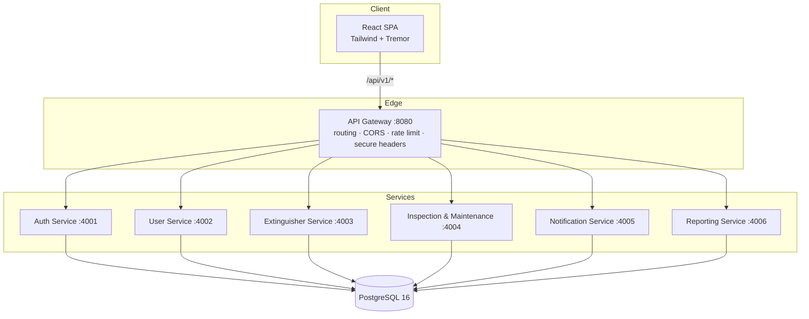
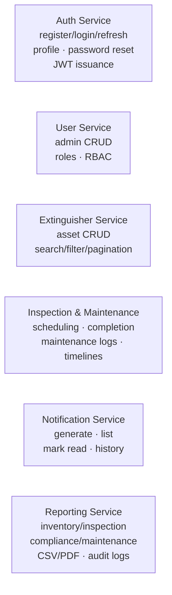
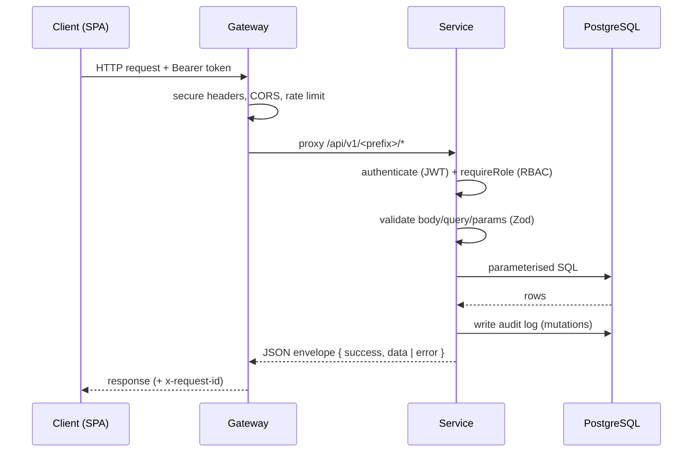

# System Architecture

## 1. Overview

The Fire Extinguisher Management System (FEMS) replaces TZW LTD's legacy
monolith with a set of loosely-coupled **RESTful microservices** behind a single
**API gateway**, consumed by a React single-page application. Each service owns
a bounded slice of the domain, can be scaled and deployed independently, and
communicates over HTTP using a consistent JSON envelope.

### Goals addressed

| Legacy pain point | How FEMS solves it |
| ----------------- | ------------------ |
| Missed inspection deadlines | Inspection scheduling + notification generation for upcoming/overdue items |
| Poor maintenance tracking | Dedicated maintenance logs with per-asset timelines |
| Compliance monitoring | Real-time compliance reports + dashboard KPIs |
| Limited scalability | Independent, stateless services behind a gateway |

## 2. Logical architecture

## 3. Microservice responsibilities

## 4. Cross-cutting concerns (shared library `@fems/shared`)

To keep services consistent and DRY, all cross-cutting behaviour lives in a
shared workspace package consumed by every service:

- **config** — validated environment access; refuses insecure secrets in prod.
- **logger** — structured (JSON) logging with secret redaction + request ids.
- **db** — single pooled PostgreSQL client; parameterised `query`/`withTransaction`.
- **errors** — typed `AppError` hierarchy mapped to HTTP status codes.
- **http** — standard success/`paginated` envelopes + `asyncHandler`.
- **jwt / password** — token signing/verification, bcrypt hashing, strength policy.
- **middleware** — `authenticate`, `requireRole` (RBAC), `validate` (Zod), security
  (helmet/CORS/rate-limit), centralised error + 404 handlers.
- **audit** — best-effort audit-log writer used by every mutating action.
- **createApp** — factory assembling a hardened Express app + health + Swagger UI.

## 5. Request lifecycle

## 6. Authentication & authorization flow

1. The client logs in via the Auth Service and receives a short-lived **access
   token** (15 min) and a long-lived **refresh token** (7 days, stored hashed).
2. Every protected request carries `Authorization: Bearer <access token>`.
3. On `401`, the SPA transparently calls `/auth/refresh` (token rotation) and
   retries once.
4. Each service independently verifies the JWT and enforces **RBAC** per route.

## 7. Data architecture

A single PostgreSQL instance hosts the relational schema. In a full production
deployment each service would own its database (database-per-service); for the
academic deployment a single instance with clear logical ownership keeps the
referential integrity demonstrable while preserving the service boundaries in
code. See [Database Design](03-database-design.md).

## 8. Technology choices

| Concern | Choice | Rationale |
| ------- | ------ | --------- |
| Runtime | Node.js 20 (ESM) | Fast, ubiquitous, great for I/O-bound REST services |
| Web framework | Express | Minimal, well understood, easy to harden |
| Validation | Zod | Declarative schemas double as documentation |
| DB access | `pg` + parameterised SQL | Full control, demonstrable SQL, injection-safe |
| Auth | JWT (`jsonwebtoken`) + bcrypt | Stateless auth + secure password storage |
| Logging | pino | Structured, fast, redaction support |
| Docs | OpenAPI 3.0 + swagger-ui-express | Interactive, standards-based |
| Frontend | React + Vite + Tailwind + Tremor | Modern enterprise dashboard UX |
| Orchestration | Docker Compose | One-command reproducible environment |

## 9. Scalability & resilience notes

- Services are **stateless** (tokens carry identity), so they scale horizontally
  behind the gateway.
- The gateway returns **502** with a friendly envelope when an upstream is down,
  isolating failures.
- Connection pooling bounds DB load; rate limiting protects against abuse.
- Health endpoints (`/health`) enable container orchestrators to manage lifecycle.
