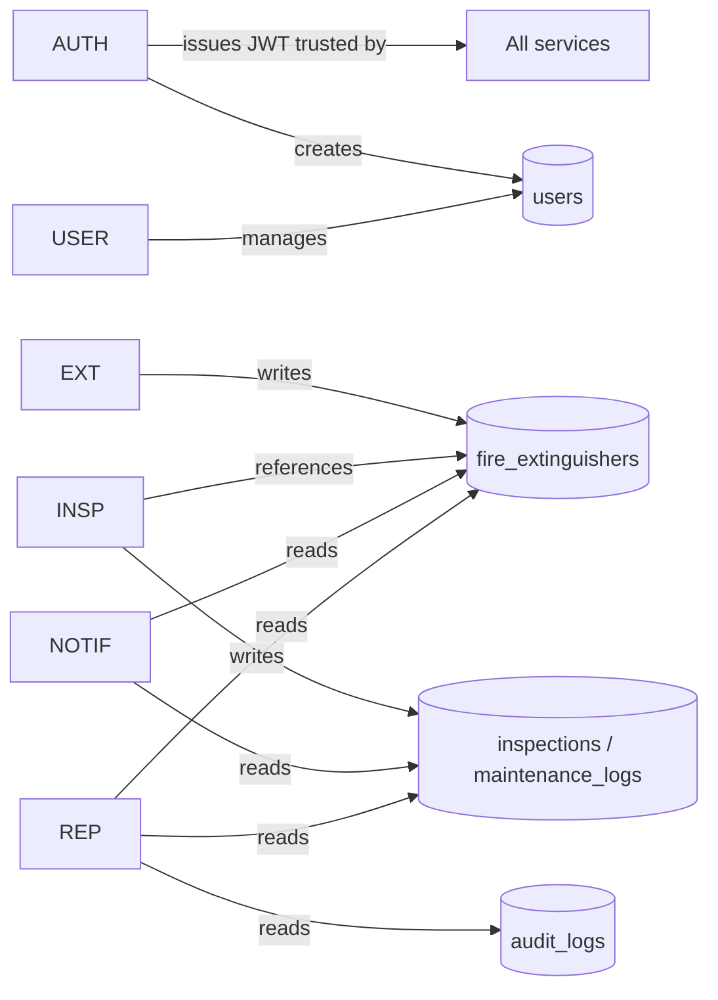

# Microservices Design

This document defines each microservice: responsibilities, endpoints, request
and response structures, validation rules and inter-service interactions.

All endpoints are exposed through the gateway under `/api/v1`. Every response
uses a consistent envelope:

```jsonc
// success
{ "success": true, "data": { /* ... */ }, "meta": { /* optional */ } }
// error
{ "success": false, "error": { "code": "VALIDATION_ERROR", "message": "...", "details": [ ... ] } }
```

Standard status codes: `200 OK`, `201 Created`, `204 No Content`, `400 Bad
Request`, `401 Unauthorized`, `403 Forbidden`, `404 Not Found`, `409 Conflict`,
`422 Validation Error`, `500 Internal Server Error`.

---

## 1. Authentication Service (`:4001`, prefix `/api/v1/auth`)

**Responsibilities:** registration, login, JWT issuance + refresh-token
rotation, logout, profile management, and the forgot/reset password workflow.

| Method | Path | Auth | Description |
| ------ | ---- | ---- | ----------- |
| POST | `/register` | – | Create a USER account, return tokens |
| POST | `/login` | – | Authenticate, return tokens |
| POST | `/refresh` | – | Rotate tokens using a refresh token |
| POST | `/logout` | – | Revoke a refresh token |
| POST | `/forgot-password` | – | Issue a reset token |
| POST | `/reset-password` | – | Consume a reset token |
| GET | `/profile` | Bearer | View current profile |
| PATCH | `/profile` | Bearer | Update profile fields |
| POST | `/change-password` | Bearer | Change password |

**Request (register):** `{ firstName, lastName, email, password }`
**Response (201):** `{ user, accessToken, refreshToken, expiresIn }`

**Validation:** first/last name required; valid email (lower-cased, unique);
strong password (≥8 chars incl. lower, upper, number, special). Duplicate email →
`409`.

**Interactions:** other services trust the JWT it issues; the user record it
creates is read by the User and Reporting services.

---

## 2. User Management Service (`:4002`, prefix `/api/v1`)

**Responsibilities:** administrative CRUD over users and read access to roles.
All routes require authentication; user routes require the **ADMIN** role.

| Method | Path | Role | Description |
| ------ | ---- | ---- | ----------- |
| GET | `/roles` | any | List roles |
| GET | `/users` | ADMIN | List users (search, role filter, pagination) |
| POST | `/users` | ADMIN | Create a user with a role |
| GET | `/users/:id` | ADMIN | Get a user |
| PUT | `/users/:id` | ADMIN | Full update |
| PATCH | `/users/:id` | ADMIN | Partial update (role/status/...) |
| DELETE | `/users/:id` | ADMIN | Delete a user |

**Validation:** valid email (unique), role ∈ {ADMIN, INSPECTOR, USER}, strong
password on create. Admins cannot delete their own account (`403`).

**Interactions:** writes to the same `users` table the Auth Service manages.

---

## 3. Fire Extinguisher Management Service (`:4003`, prefix `/api/v1/extinguishers`)

**Responsibilities:** manage extinguisher assets with search, filtering and
pagination.

| Method | Path | Role | Description |
| ------ | ---- | ---- | ----------- |
| GET | `/` | any | List/search (serial, location, type, status) |
| GET | `/:id` | any | View by id |
| POST | `/` | ADMIN/INSPECTOR | Register |
| PUT | `/:id` | ADMIN/INSPECTOR | Full update |
| PATCH | `/:id` | ADMIN/INSPECTOR | Partial update |
| DELETE | `/:id` | ADMIN | Delete |

**Fields:** `serialNumber, location, type, size, installationDate, expiryDate,
status`.
**Enums:** type ∈ {Water, CO2, Foam, Dry Chemical}; size ∈ {2.5 lbs, 5 lbs,
9 lbs, 12 lbs}; status ∈ {Active, Expired, Maintenance, Decommissioned}.

**Validation:** unique serial number (`409` on conflict); required location/
type/size; **expiry date must be after installation date** (`422`).

**Query parameters:** `page, limit, search, serialNumber, location, type,
status, sortBy, sortDir`.

**Interactions:** referenced by the Inspection, Notification and Reporting
services via `extinguisher_id`.

---

## 4. Inspection & Maintenance Service (`:4004`, prefix `/api/v1`)

**Responsibilities:** schedule and complete inspections; log maintenance; build
per-asset timelines.

| Method | Path | Role | Description |
| ------ | ---- | ---- | ----------- |
| GET | `/inspections` | any | List (status/extinguisher/inspector filters) |
| POST | `/inspections` | any | Schedule an inspection |
| GET | `/inspections/:id` | any | Get an inspection |
| PATCH | `/inspections/:id` | ADMIN/INSPECTOR | Update / complete |
| POST | `/inspections/:id/cancel` | any | Cancel an inspection |
| GET | `/maintenance` | any | List maintenance logs |
| POST | `/maintenance` | ADMIN/INSPECTOR | Log a maintenance activity |
| GET | `/timelines/:extinguisherId` | any | Combined inspection + maintenance timeline |

**Inspection fields:** `extinguisherId, inspectorId?, inspectionDate,
inspectionTime, notes?`.
**Maintenance fields:** `extinguisherId, inspectionId?, actionTaken,
maintenanceDate, issuesIdentified?, notes?, recommendations?`.

**Validation:** the extinguisher must exist (`404`); inspection date **cannot be
in the past** (`422`); duplicate slot for the same extinguisher/date/time is
rejected (`409`, also enforced by a DB unique constraint). Completing an
inspection sets `completed_at` automatically.

**Interactions:** reads `fire_extinguishers`; its data feeds the Notification
and Reporting services.

---

## 5. Notification Service (`:4005`, prefix `/api/v1`)

**Responsibilities:** generate notifications from domain data and serve the
notification centre with read tracking.

| Method | Path | Role | Description |
| ------ | ---- | ---- | ----------- |
| GET | `/notifications` | any | List (type/read filters, pagination) |
| GET | `/notifications/unread-count` | any | Badge counter |
| PATCH | `/notifications/:id/read` | any | Mark one read |
| POST | `/notifications/mark-all-read` | any | Mark all read |
| POST | `/notifications/generate` | ADMIN | Scan domain data and create notifications |

**Generated types:** `INSPECTION_UPCOMING` (≤7 days), `INSPECTION_OVERDUE`,
`EXTINGUISHER_EXPIRING` (≤30 days), `MAINTENANCE_REMINDER`. Generation is
idempotent per `(type, entity_id, day)`.

**Interactions:** reads `inspections` and `fire_extinguishers`; in production
the generator would run on a schedule (cron).

---

## 6. Reporting Service (`:4006`, prefix `/api/v1`)

**Responsibilities:** real-time reports, a single dashboard aggregate, CSV/PDF
export and audit-log access.

| Method | Path | Role | Description |
| ------ | ---- | ---- | ----------- |
| GET | `/reports/dashboard` | any | KPIs + analytics + activity feed |
| GET | `/reports/inventory` | any | Totals + distributions |
| GET | `/reports/inspections` | any | Pending/completed/overdue + trend |
| GET | `/reports/compliance` | any | Expired/upcoming + compliance % |
| GET | `/reports/maintenance` | any | Recent/frequency/monthly |
| GET | `/reports/export?type=&format=` | any | Download CSV or PDF |
| GET | `/audit-logs` | ADMIN | List audit entries (filters, pagination) |

**Interactions:** read-only aggregate queries across all domain tables and the
`audit_logs` table.

---

## Inter-service interaction summary



Services do not call each other synchronously at runtime (low coupling); they
collaborate through the shared relational store and the JWT trust boundary. This
keeps latency low and avoids cascading failures, while the gateway provides the
single public surface.
