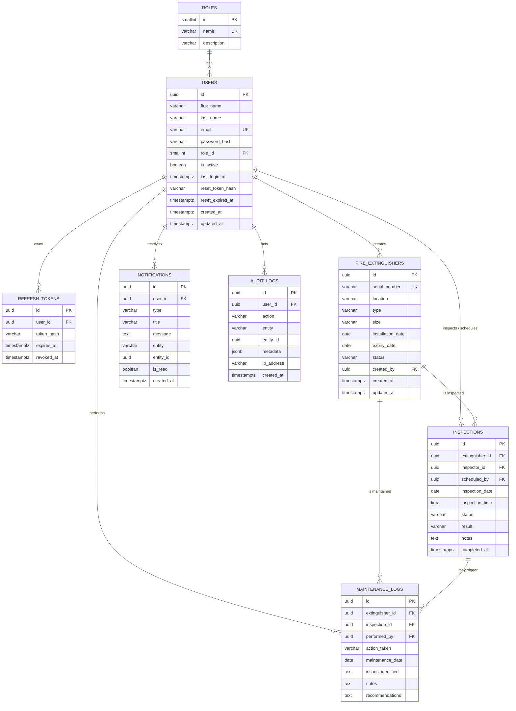

# Database Design

The system uses **PostgreSQL 16**. The schema is defined in
[`database/sql/01_schema.sql`](../database/sql/01_schema.sql) with reference data
in [`02_reference_data.sql`](../database/sql/02_reference_data.sql).

## 1. Entity-Relationship Diagram



## 2. Tables & relationships

| Table | Purpose | Key relationships |
| ----- | ------- | ----------------- |
| `roles` | RBAC role lookup (ADMIN/INSPECTOR/USER) | `users.role_id → roles.id` |
| `users` | Accounts (bcrypt password hash only) | parent of most tables |
| `refresh_tokens` | Issued refresh tokens (hashed) for logout/rotation | `→ users` (CASCADE) |
| `fire_extinguishers` | Core managed asset | `created_by → users` |
| `inspections` | Scheduled/completed inspections | `→ fire_extinguishers` (CASCADE), `→ users` |
| `maintenance_logs` | Maintenance history | `→ fire_extinguishers` (CASCADE), `→ inspections`, `→ users` |
| `notifications` | Notification centre history | `→ users` (CASCADE) |
| `audit_logs` | Security-relevant action trail | `→ users` (SET NULL) |

## 3. Constraints

- **Primary keys:** UUID (`gen_random_uuid()`) on all entities; `SMALLINT` on roles.
- **Unique:** `users.email`, `fire_extinguishers.serial_number`,
  `roles.name`, and `inspections(extinguisher_id, inspection_date,
  inspection_time)` to prevent duplicate scheduling.
- **Check constraints:** controlled vocabularies for `roles.name`,
  extinguisher `type`/`size`/`status`, inspection `status`/`result`,
  notification `type`; an email-format check; and
  **`expiry_date > installation_date`** for extinguishers.
- **Foreign keys:** enforce referential integrity with appropriate
  `ON DELETE` behaviour (`CASCADE` for ownership, `SET NULL` for audit/actor
  references so history survives user deletion).

## 4. Indexes

Indexes back the documented search/filter/sort access patterns:

- `users`: `role_id`, `lower(email)`
- `fire_extinguishers`: `status`, `type`, `location`, `expiry_date`,
  `lower(serial_number)`
- `inspections`: `extinguisher_id`, `inspector_id`, `status`, `inspection_date`
- `maintenance_logs`: `extinguisher_id`, `maintenance_date`
- `notifications`: `(user_id, is_read)`, `created_at`
- `audit_logs`: `user_id`, `(entity, entity_id)`, `created_at`

## 5. Triggers

A `set_updated_at()` trigger keeps `updated_at` current on row updates for
`users`, `fire_extinguishers` and `inspections`.

## 6. Relational schema (DDL)

The complete, runnable DDL is in
[`database/sql/01_schema.sql`](../database/sql/01_schema.sql). Apply it with:

```bash
npm run db:migrate   # runs every file in database/sql in order
npm run db:seed      # loads realistic sample data
```

## 7. Backups

Logical backups use `pg_dump` (custom compressed format):

```bash
./database/scripts/backup.sh           # creates database/backups/fems_<timestamp>.dump
./database/scripts/restore.sh <file>   # restores a backup
```

The backup script keeps the 14 most recent backups and reads all connection
settings from environment variables.
