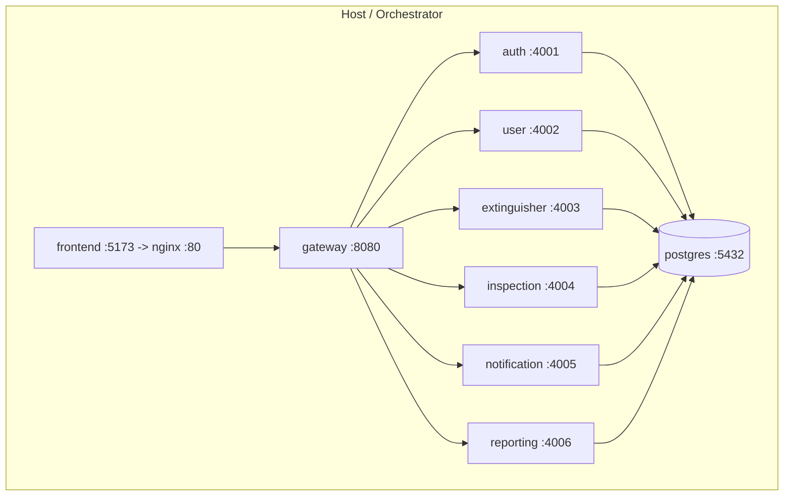

# Deployment Guide

## 1. Topology



## 2. Container images

A single generic [`Dockerfile`](../Dockerfile) builds every Node service; the
target is chosen with the `SERVICE` build argument. The frontend has its own
multi-stage [`frontend/Dockerfile`](../frontend/Dockerfile) (Vite build → nginx).

```bash
docker compose build
docker compose up -d
```

## 3. Configuration (environment variables)

All configuration is supplied via environment variables — **no secrets in code**.
See [`.env.example`](../.env.example). Critical production settings:

| Variable | Purpose |
| -------- | ------- |
| `DATABASE_URL` | PostgreSQL connection string |
| `JWT_ACCESS_SECRET` / `JWT_REFRESH_SECRET` | Long random secrets (the app refuses to boot in prod with defaults) |
| `JWT_ACCESS_TTL` / `JWT_REFRESH_TTL` | Token lifetimes |
| `BCRYPT_ROUNDS` | Password hashing cost (≥12 recommended) |
| `CORS_ORIGINS` | Comma-separated allow-list of front-end origins |
| `RATE_LIMIT_*` | Request rate limits |
| `*_SERVICE_URL` | Internal service URLs used by the gateway |

> In production set `NODE_ENV=production`. The config layer **fails fast** if the
> JWT secrets are still the insecure development defaults.

## 4. Production hardening checklist

- [ ] Replace all secrets in `.env`; rotate JWT secrets periodically.
- [ ] Terminate TLS at a reverse proxy / load balancer in front of the gateway.
- [ ] Restrict `CORS_ORIGINS` to the real frontend origin(s).
- [ ] Run PostgreSQL with least-privilege credentials and managed backups.
- [ ] Set container resource limits and configure `/health` probes.
- [ ] Ship structured logs to a central aggregator (logs are JSON with request ids).
- [ ] Schedule the notification generator (`POST /notifications/generate`) via cron.
- [ ] Schedule `database/scripts/backup.sh` (e.g. nightly) and test restores.

## 5. API documentation (Swagger)

The gateway serves a **single Swagger UI** with every microservice spec in the
explorer dropdown:

- **URL:** `http://<gateway-host>:8080/docs` (local dev: `http://localhost:8080/docs`)
- **Per-service OpenAPI:** proxied at `/docs/openapi/<service-name>.json` (no CORS issues)
- From the Vite dev frontend (`:5173`), open **Settings → Open Swagger UI** (`/docs` is proxied to the gateway)

## 6. Health & readiness

Every service exposes `GET /health` returning `200` (DB reachable) or `503`
(degraded). Use these as container liveness/readiness probes.

## 7. Scaling

Services are stateless; scale any of them horizontally (e.g. `docker compose up
-d --scale reporting-service=3` behind the gateway, or replicas in Kubernetes).
The database is the shared stateful component — scale it with read replicas and
connection pooling as load grows.

## 8. Zero-downtime updates

Because services are independent, deploy them one at a time. The gateway returns
a friendly `502` for any briefly-unavailable upstream rather than failing the
whole request surface.

## 9. Backups & disaster recovery

```bash
# Nightly logical backup (cron)
0 2 * * *  /app/database/scripts/backup.sh

# Restore
./database/scripts/restore.sh database/backups/fems_20260101_020000.dump
```
